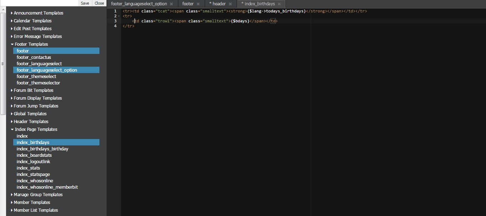

# Template Editor MyBB Plugin
TemplateEditor is a good plugin for AdminCP -> Themes and Templates.

With this plugin you can edit your templates with AJAX, change multiple templates in one page and ...

## Hotkeys:

- `Ctrl - S`: Save
- `Alt - W`: Close Tab
- `Ctrl - space / Alt` - Return: Auto Complete.
- `Ctrl - ,` - Editor Settings

## Preview:

